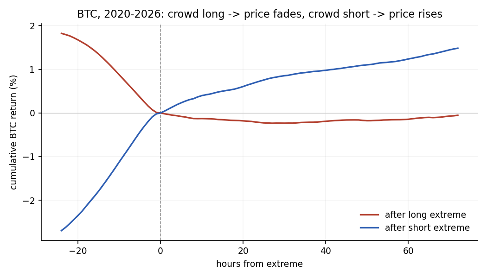
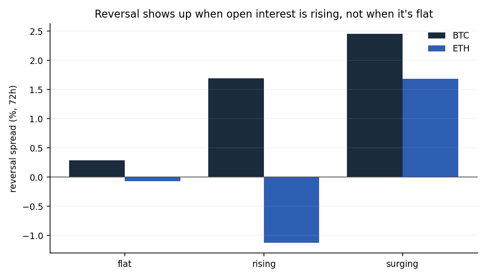

# Crowd positioning vs. reversals in crypto futures

**The gap.** The crowded-trades literature argues that positions concentrated on one side
unwind against the crowd, but it almost always has to infer positioning indirectly — from
flows, from price action, from surveys — because equity markets don't publish who is
holding what. Crypto perpetuals do. Binance reports the ratio of accounts long versus short
every five minutes, going back years, alongside open interest and event-level liquidations.

**What I do with it.** I use that record to test the reversal claim directly on BTC and ETH,
and I find it only holds under a condition nobody can test without leverage data: the
reversal appears when open interest is climbing, and essentially vanishes when it isn't.
Crowding on its own does very little. Crowding financed with leverage does a lot.

**Why it should work at all.** The mechanism is mechanical, not psychological. Perp
positions are leveraged, so a crowd sitting long is a stack of margin and stop levels
underneath the price. Those positions are not opinions — they are inventory that *has* to
be closed if price moves far enough, and closing them means selling. That gives the market
something to trade toward. When the same crowd is long with no leverage building behind it,
there is nothing to consume, and there is no reversal to speak of. The liquidation data
supports this reading directly.

BTC/USDT from 2020-09, ETH/USDT from 2021-12, hourly. This is a study of the effect —
I make no claim about a tradeable strategy.

Full writeup: **[RESEARCH.md](RESEARCH.md)** / [PDF](crowd-positioning-reversals.pdf).

## What the data shows

Positioning comes from the long/short **account** ratio (Binance's own metric — it counts
accounts, not size). An extreme is |z| > 1.5, z-scored against 168/336/720h lookbacks.
The statistic is the gap between forward returns after a short extreme and after a long one:
positive means price moved against the crowd in both directions.

Unconditionally, BTC reverses at every horizon (t = 11–13, survives Benjamini-Hochberg,
+1.5% at 72h), while ETH only does so at short horizons and then loses it. That looks like a
contradiction until you split by whether open interest is growing:

```
                BTC (72h)        ETH (72h)
OI flat         +0.28%  t=1.2    -0.07%  t=-0.3
OI rising       +1.69%  t=8.9    -1.12%  t=-5.2
OI surging      +2.45%  t=14.1   +1.68%  t=6.1
```

In the surging bucket the two assets agree. ETH's negative headline number comes from the
middle bucket, where crowded longs are followed by *more* upside — the signature of a market
where price is being pushed by spot flow the crowd happens to be aligned with, rather than by
the crowd itself. ETH spent much of 2025-26 in that state.

So the claim isn't "price reverses against the crowd." It's: price reverses against the crowd
when the crowd is the marginal buyer, and doesn't when it isn't.

Liquidations back the mechanism up: in the 24h after a long extreme, long liquidations run
2.4x normal on BTC (1.2x on ETH, though that sample is only ~1 year).





## Files

```
src/build.py       merge raw dumps into the hourly panel
src/analysis.py    spread by horizon, split by OI regime, FDR, liquidation check
src/figures.py     the two plots
figures/           event profile, OI-regime bars
data/              results_btc.csv, results_eth.csv, RESULTS.txt, DATA_NOTES.txt
```

```
pip install -r requirements.txt
python src/build.py
python src/analysis.py
python src/figures.py
```

The raw Binance dumps aren't in the repo — they're large and not mine to host.
`data/DATA_NOTES.txt` gives the exact endpoint or archive path behind every file, so
`build.py` runs once you've pulled them.

## Caveats

- Liquidation history only goes back ~1 year for these pairs (Binance's own USDT-M
  liquidation archive is empty — checked), so that check runs on a shorter window than the
  main result.
- The account ratio is a proxy for "the crowd": Binance accounts, not the whole market, and
  it says nothing about size behind each account.
- OI terciles are a coarse split. I read the regime result as a conditional relationship,
  not as proof of causation.
- Forward windows overlap, which inflates the t-statistics. The BTC effect is large enough
  that this is unlikely to be the whole story, but the exact figures aren't precise.

## Data

Binance Futures USDT-M, all public: klines and funding from the REST API, open interest and
long/short ratios from the data.binance.vision daily archive (5-min), liquidations from
CryptoHFTData. Ranges in `data/DATA_NOTES.txt`.
